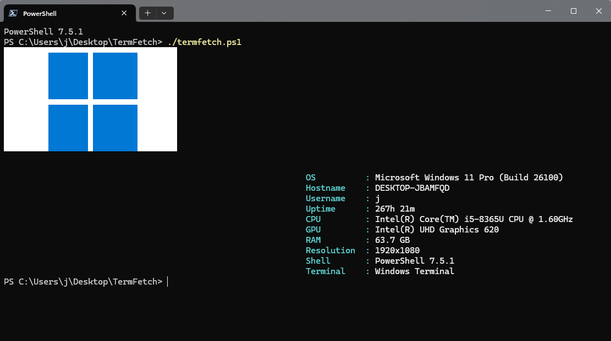

# TermFetch

**TermFetch** is a lightweight PowerShell system info fetch script, inspired by Linux tools like `neofetch`. It displays an ASCII or image-based logo alongside system information inside your terminal.

This script is designed for Windows users who want a clean, terminal-friendly overview of their system stats, complete with logo support and customizable output.

---



---

## Features

* Detects Windows OS version and build
* Displays:

  * OS
  * Hostname
  * Username
  * Uptime
  * CPU and GPU info
  * RAM usage
  * Resolution
  * Shell and Terminal info
* Supports logo display (image-based)
* Customizable logo folder and dimensions

---

## Usage

Run from a PowerShell terminal:

```powershell
./termfetch.ps1
```

Ensure you have your logos in a folder named `logos` in the same directory. Supported logos include Windows 10, 11, Server variants, and a generic fallback.

---

## Requirements

* PowerShell 5.0+
* Windows 10 or later
* ImageMagick or compatible image renderer for logo (optional)

---

## Customization

* Modify `termfetch.ps1` to change logo size, info displayed, or formatting.

---

## License

MIT License

---

## Credits

Made by Kelsi Davis. Inspired by neofetch.

---

> Pull requests and feature suggestions are welcome!
